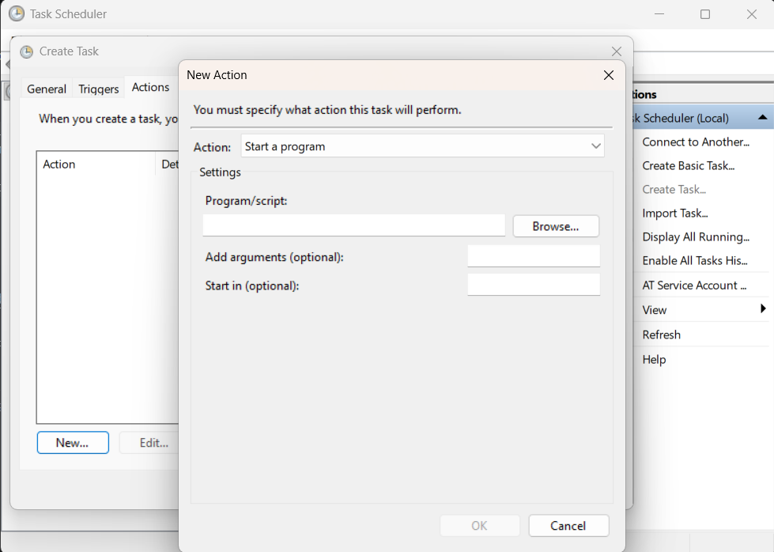

# Introduction

The word Cron comes from Chronos, the greek god of time. It should be no shocker then that Cron is used to schedule jobs on unix systems! Here's an overview of the general system:

- Cron is the daemon that makes sure everything gets run on time. 
- Crontab are tables (tabs) that state when the job should be run.
- Jobs are usually scripts that you write that are executed when the Crontab has scheduled them.

Some Dev/Ops jobs that would be a good fit for using Cron would be clearing logs, making backups, or running daily tests. If a programmer made a script for these tasks, they could use Cron to schedule it on the system. This makes it an ideal tool for small systems to manage themselves. 

Cron can also be set up to email the output of the programs it runs. This means that logs or test output can be sent to a developer every so often. It can alert the developer if there were any problems with the script.

## Cron
Cron is the daemon that gets run on system startup. It comes with most modern Linux distributions. On startup, it will load up the Cron tables into memory and start running scheduled jobs. If it is setup correctly, it can send mail with the output of the program to the programmed address.

When a time-zone respects daylight savings, Cron will make sure that jobs that would have been run in the interval run exactly once. If the clock changes more than three hours, Cron considers this a timezone correction and may skip certain jobs. If a job needs to run on a different time zone schedule, that can be set in the Crontab.

Cron only runs while the system is running. If the system turns off frequently, Cron may miss certain jobs. This could be solved by using something like Anacron, which records the last time the job was run. Then at startup, Anacron is able to determine what should be run to makeup for the time offline.

While Cron has a couple of different distributions of Daemons, Crontab syntax remains the same between them.

## Crontab

Crontab files are used to define the schedule for which jobs should run. Comments can be defined with `#` signs, and environment variables can be set. A schedule is then defined before the command to run. Syntax for the schedule is defined below:

```
CRON_TZ=Japan # set the timezone to run in
#┌───────────── minute (0 - 59)
#│ ┌───────────── hour (0 - 23)
#│ │ ┌───────────── day of the month (1 - 31)
#│ │ │ ┌───────────── month (1 - 12)
#│ │ │ │ ┌───────────── day of the week (0 - 6) (Sunday to Saturday)
#│ │ │ │ │                                   
#│ │ │ │ │
#│ │ │ │ │
 * * * * * optionalUsername echo "run every minute"%This will go to stdin%This is a newline also going to stdin
```

Unless escaped with a `\` the `%` character indicates a newline, and can send input to standard in.

Three letter abbreviations are allowed for months (`jan`, `may`, `nov`) and days of the week (`mon`, `wed`, `fri`).

A list of times can be set by adding a range with a `-` (`mon-fri`) or by listing a set of values separated by commas (`1,15,28`).

There is also support for step values, which allows you to define a range and step over a range of values. For example, `0-29/15` in the minutes column would cause the job to execute at the top of the hour and 15 minutes past. This can also be used with asterisks, so `*/15` would cause the program to run every 15 minutes.

Crontabs are in installed with the `crontab` command. A user can be specified with the `-u` command, and the file can be tested with the `-T` command to make sure the syntax is correct before install. Here's an example of using these commands

```
crontab -u root -T myCrontab
```

When ready to install the Crontab, the `-T` should be omitted. 

## Windows Users
Although Cron is not a Windows feature, there is the Task Scheduler, which accomplishes the same goal. The process is similar to defining a Crontab. A trigger needs to be defined, as well as an action—the custom script. Below is an example of the GUI, however, the following can be done from the command line as well.



# Sources
 - man7.org
 - https://wiki.archlinux.org/
 - Wikipedia
 - https://kubernetes.io/docs/concepts/workloads/controllers/cron-jobs/
 - https://last9.io/blog/manage-cron-jobs-in-windows/